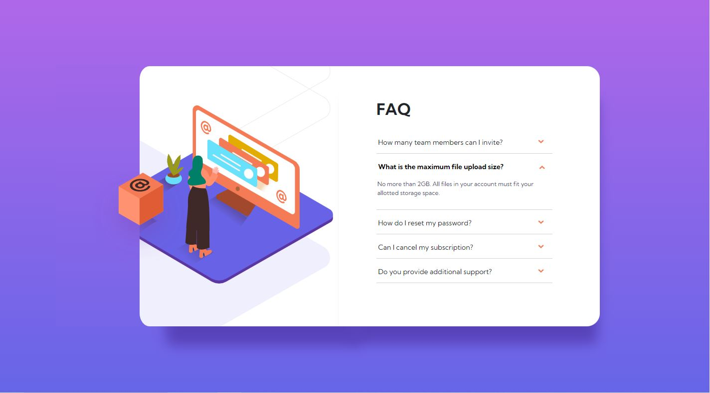
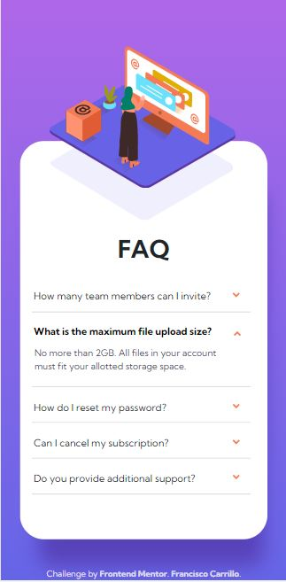

# Frontend Mentor - FAQ accordion card solution

This is a solution to the [FAQ accordion card challenge on Frontend Mentor](https://www.frontendmentor.io/challenges/faq-accordion-card-XlyjD0Oam). Frontend Mentor challenges help you improve your coding skills by building realistic projects. 

## Table of contents## Table of contents

- [Overview](#overview)
  - [Screenshot](#screenshot)
  - [Links](#Links)
- [My process](#my-process)
  - [Built with](#built-with)
  - [What I learned](#what-i-learned)
  - [Useful resources](#useful-resources)
- [Author](#author)

## Overview

### Screenshot





### Links

- [Solution URL](https://github.com/frank-itachi/Web-Development/tree/master/faq-accordion)
- [Live Site URL](https://frank-itachi.github.io/Web-Development/faq-accordion-accordion/)

## My process

### Built with

- Semantic HTML5 markup
- CSS custom properties
- BootStrap Grid
- BootStrap d-flex utility

### What I learned

This challenge made me dig up about the CSS position and z-index properties. In order to put one element over the other I needed to understand the stacking order and also how the x, y and z axes affects the elements inside the html document.

Something that I didn’t know was that for the z-index property to take effect, the element needs to have a positioning property other than the default. 


```css
.col {
    position: relative;
}
 ...

 .sec-col-1 {
    width: 14%;
    background: linear-gradient(0deg, hsl(240, 73%, 65%) -38%, hsl(273, 75%, 66%) 130%);
    z-index: 1;
}

 ...

 .box-img, .main-img {
    position: absolute
}

.box-img {
    top: 40.5%;
    left: 44.5%;
}

.main-img {
    top: 15%;
    right: 3%;
}

```

### Useful resources

- [BootStrap](https://getbootstrap.com/docs/5.3/components/card/) 
- [BootStrap](https://getbootstrap.com/docs/5.0/layout/grid/)
- [BootStrap](https://getbootstrap.com/docs/5.0/utilities/flex/)

## Author

- GitHub - [Francisco Carrillo](https://github.com/frank-itachi)
- Frontend Mentor - [@frank-itachi](https://www.frontendmentor.io/profile/frank-itachi)