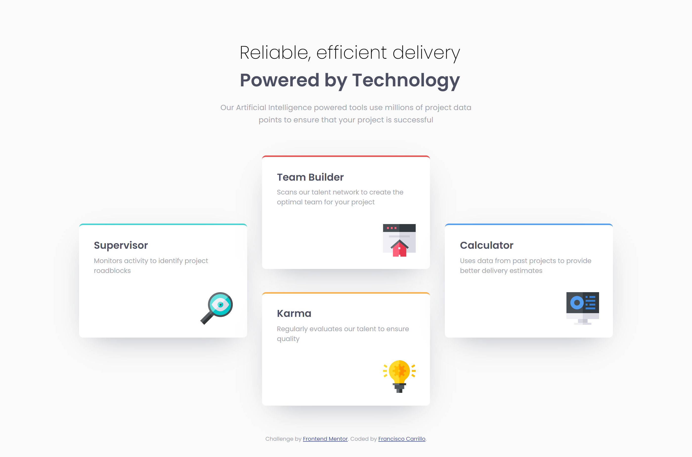
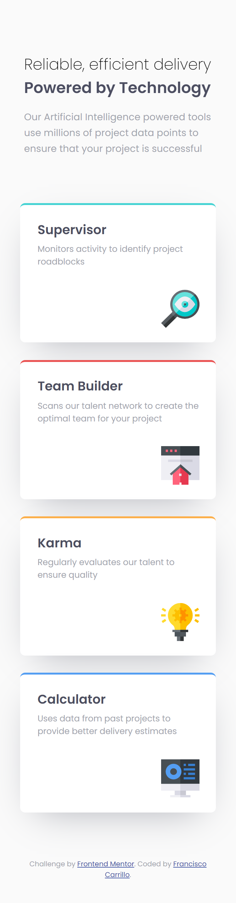

# Frontend Mentor - Four card feature section solution

This is a solution to the [Four card feature section challenge on Frontend Mentor](https://www.frontendmentor.io/challenges/four-card-feature-section-weK1eFYK). Frontend Mentor challenges help you improve your coding skills by building realistic projects. 

## Table of contents

- [Overview](#overview)
  - [Screenshot](#screenshot)
  - [Links](#Links)
- [My process](#my-process)
  - [Built with](#built-with)
- [Author](#author)

## Overview

### Screenshot

### Links

- [Solution URL](https://github.com/frank-itachi/Web-Development/tree/master/four-card-feature-section)
- [Live Site URL](https://frank-itachi.github.io/Web-Development/four-card-feature-section/)

## My process

### Built with

- Semantic HTML5 markup
- CSS custom properties
- CSS Grid
- CSS flex

## Author

- GitHub - [Francisco Carrillo](https://github.com/frank-itachi)
- Frontend Mentor - [@frank-itachi](https://www.frontendmentor.io/profile/frank-itachi)