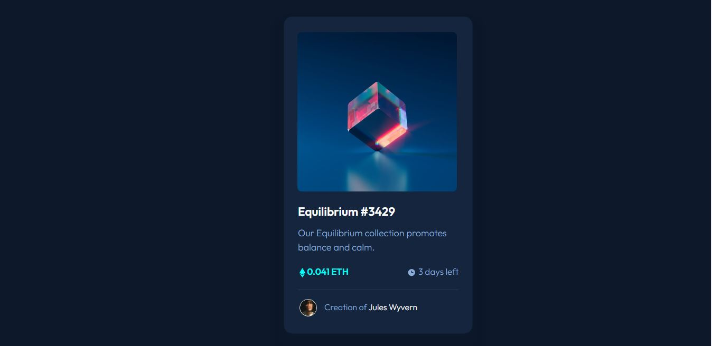
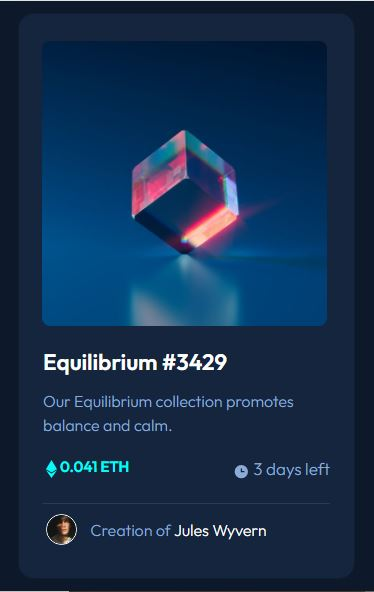

# Frontend Mentor - NFT preview card component solution

This is a solution to the [NFT preview card component challenge on Frontend Mentor](https://www.frontendmentor.io/challenges/nft-preview-card-component-SbdUL_w0U). Frontend Mentor challenges help you improve your coding skills by building realistic projects. 

## Table of contents

- [Overview](#overview)
  - [Screenshot](#screenshot)
  - [Links](#Links)
- [My process](#my-process)
  - [Built with](#built-with)
  - [What I learned](#what-i-learned)
  - [Useful resources](#useful-resources)
- [Author](#author)

## Overview

### Screenshot





### Links

- [Solution URL](https://github.com/frank-itachi/Web-Development/tree/master/nft-preview-card-component)
- [Live Site URL](https://frank-itachi.github.io/Web-Development/nft-preview-card-component/)

## My process

### Built with

- Semantic HTML5 markup
- CSS custom properties
- BootStrap Grid
- BootStrap d-flex utility
- BootStrap cards
- Z-index

### What I learned

I had to read a little a bit about the position and z-index CSS properties which in this case were crucial to put the view icon on top the main image when the user hovers the mouse over the image.

```css
.card, .main-img {
    position: relative;
}

.main-img {
    z-index: 1;
    width: 100%;
}

.icon-view {
    position: absolute;
    top: 27%;
    left: 43%;
}
```


### Useful resources

- [BootStrap](https://getbootstrap.com/docs/5.3/components/card/) 
- [BootStrap](https://getbootstrap.com/docs/5.3/utilities/shadows/)
- [BootStrap](https://getbootstrap.com/docs/5.3/utilities/flex/#align-items)

## Author

- GitHub - [Francisco Carrillo](https://github.com/frank-itachi)
- Frontend Mentor - [@frank-itachi](https://www.frontendmentor.io/profile/frank-itachi)