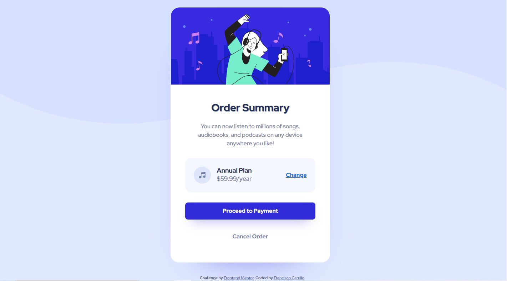

# Frontend Mentor - Order summary card solution

This is a solution to the [Order summary card challenge on Frontend Mentor](https://www.frontendmentor.io/challenges/order-summary-component-QlPmajDUj). Frontend Mentor challenges help you improve your coding skills by building realistic projects. 


## Table of contents

- [Overview](#overview)
  - [Screenshot](#screenshot)
  - [Links](#Links)
- [My process](#my-process)
  - [Built with](#built-with)
  - [What I learned](#what-i-learned)
  - [Useful resources](#useful-resources)
- [Author](#author)

## Overview

### Screenshot




### Links

- [Solution URL](https://github.com/frank-itachi/Web-Development/tree/master/order-summary-component)
- [Live Site URL](https://frank-itachi.github.io/Web-Development/order-summary-component/)

## My process

### Built with

- Semantic HTML5 markup
- CSS custom properties
- BootStrap Grid
- BootStrap d-flex utility
- BootStrap cards

### What I learned

Something that I really liked and learned was that I was able to implement bootstrap cards components with the help of the documentation. 

I struggled traying to center align the card element  but with the help of bootstrap d-flex utility and using the class “min-vh-100 d-flex align-items-center” I could finally make it. For the mobile design I used CSS media query.

```html
<section id="main" class="container-fluid min-vh-100 d-flex align-items-center">
```
```css
./* Mobile Design  */

@media (max-width: 375px){
    ...
}
```


### Useful resources

- [BootStrap](https://getbootstrap.com/docs/5.3/components/card/) 
- [BootStrap](https://getbootstrap.com/docs/5.3/utilities/shadows/)
- [BootStrap](https://getbootstrap.com/docs/5.3/utilities/flex/#align-items)

## Author

- GitHub - [Francisco Carrillo](https://github.com/frank-itachi)
- Frontend Mentor - [@frank-itachi](https://www.frontendmentor.io/profile/frank-itachi)
