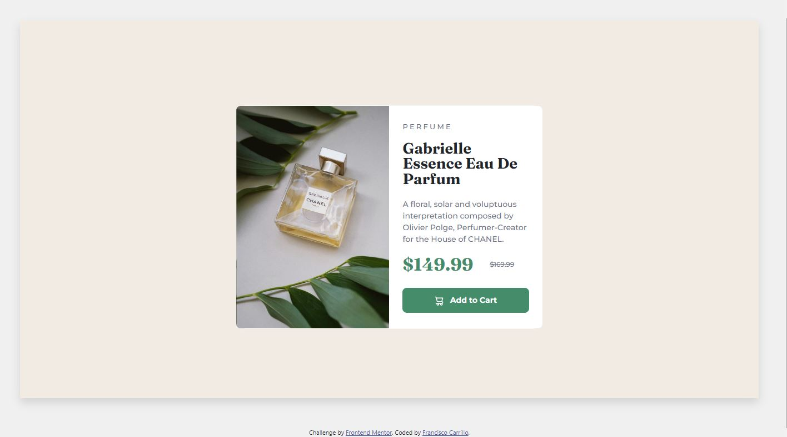

# Frontend Mentor - Product preview card component solution

This is a solution to the [Product preview card component challenge on Frontend Mentor](https://www.frontendmentor.io/challenges/product-preview-card-component-GO7UmttRfa). Frontend Mentor challenges help you improve your coding skills by building realistic projects. 

## Table of contents

- [Overview](#overview)
  - [Screenshot](#screenshot)
  - [Links](#Links)
- [My process](#my-process)
  - [Built with](#built-with)
  - [What I learned](#what-i-learned)
  - [Useful resources](#useful-resources)
- [Author](#author)

## Overview

### Screenshot





### Links

- [Solution URL](https://github.com/frank-itachi/Web-Development/tree/master/product-preview-card-component)
- [Live Site URL](https://frank-itachi.github.io/Web-Development/product-preview-card-component/)

## My process

### Built with

- Semantic HTML5 markup
- CSS custom properties
- BootStrap Grid
- BootStrap d-flex utility
- BootStrap cards

### What I learned

I found a little bit tricky changing the desktop image to the mobile so I had to made research and found that background-image property was the best approach for me. So, I decided to use that property and when the viewport size is below 576px, the image URL changes.

```css

/* Image Section  */

.image-section{
    padding-right: 0;
    background-image: url("../images/image-product-desktop.jpg");
    background-position: center;
    background-size: cover;
    padding-left: 0;
    border-radius: .5rem 0 0 .5rem;
}

./* Mobile Design  */

@media (max-width: 576px){
  ...
   .image-section {
        background-image: url("../images/image-product-mobile.jpg");
        background-position: center;
        background-size: cover;
        height: 220px;
    }
  ...
}
```


### Useful resources

- [BootStrap](https://getbootstrap.com/docs/5.3/components/card/) 
- [BootStrap](https://getbootstrap.com/docs/5.3/utilities/shadows/)
- [BootStrap](https://getbootstrap.com/docs/5.3/utilities/flex/#align-items)

## Author

- GitHub - [Francisco Carrillo](https://github.com/frank-itachi)
- Frontend Mentor - [@frank-itachi](https://www.frontendmentor.io/profile/frank-itachi)