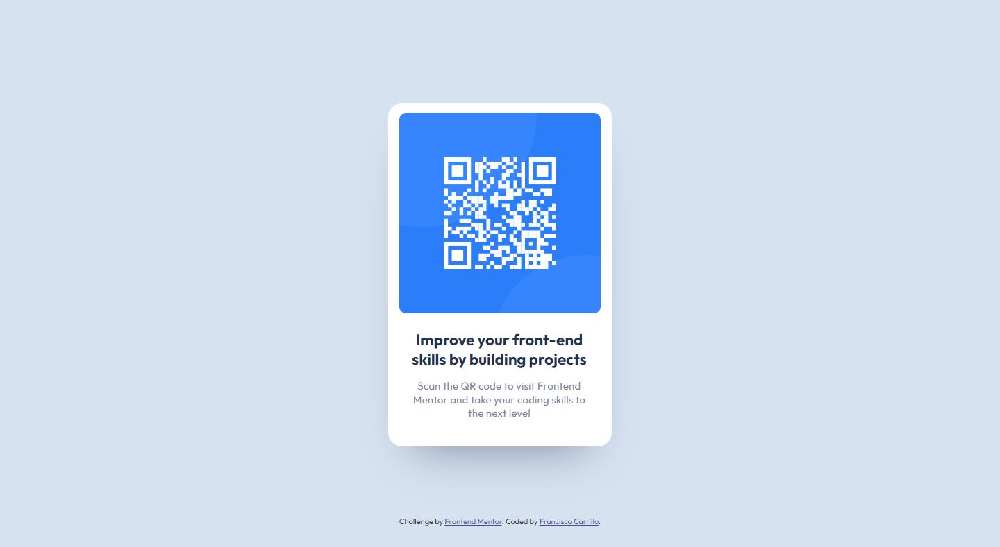

# Frontend Mentor - QR code component solution

This is a solution to the [QR code component challenge on Frontend Mentor](https://www.frontendmentor.io/challenges/qr-code-component-iux_sIO_H). Frontend Mentor challenges help you improve your coding skills by building realistic projects. 

## Table of contents

- [Overview](#overview)
  - [Screenshot](#screenshot)
  - [Links](#Links)
- [My process](#my-process)
  - [Built with](#built-with)
  - [What I learned](#what-i-learned)
  - [Useful resources](#useful-resources)
- [Author](#author)

## Overview

### Screenshot




### Links

- [Solution URL](https://github.com/frank-itachi/Web-Development/tree/master/qr-code-component)
- [Live Site URL](https://frank-itachi.github.io/Web-Development/qr-code-component/)

## My process

### Built with

- Semantic HTML5 markup
- CSS custom properties
- BootStrap Grid
- BootStrap d-flex utility
- BootStrap cards

### What I learned

Something that I really liked and learned was that I was able to implement bootstrap cards components with the help of the documentation. I also learned that implementing the card’s shadow was straightforward by using a bootstrap class. For the mobile design I used CSS media query.

```html
<div class="card qr-card shadow">
  
  <div class="card-body">
    <h5 class="card-title">Improve your front-end skills by building projects</h5>
      <p class="card-text">Scan the QR code to visit Frontend Mentor and take your coding skills to the next level</p>
  </div>
</div>
```
```css
./* Mobile Design  */

@media (max-width: 375px){
    .section-content {
        top: 15%;
        padding: 0 7%;
    }
}
```


### Useful resources

- [BootStrap](https://getbootstrap.com/docs/5.3/components/card/) 
- [BootStrap](https://getbootstrap.com/docs/5.3/utilities/shadows/)

## Author

- GitHub - [Francisco Carrillo](https://github.com/frank-itachi)
- Frontend Mentor - [@@frank-itachi](https://www.frontendmentor.io/profile/frank-itachi)
